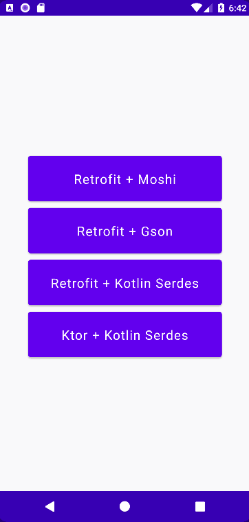

# Simple REST API App Demo (Jetpack Compose)

This app shows multiple HTTP client library implementations and their loading time.



## Requirements
- Android Studio Bumblebee or later

## Tech Stack
- [Jetpack Compose](https://developer.android.com/jetpack/compose)
- [Retrofit](https://square.github.io/retrofit) + [Moshi](https://github.com/square/moshi)
- [Retrofit](https://square.github.io/retrofit) + [Gson](https://github.com/square/retrofit/tree/master/retrofit-converters/gson) (Gson converter for Retrofit)
- [Retrofit](https://square.github.io/retrofit) + [Kotlin Serialization](https://github.com/JakeWharton/retrofit2-kotlinx-serialization-converter) (Kotlin Serialization converter for Retrofit)
- [Ktor Client](https://ktor.io/docs/getting-started-ktor-client.html) + [Kotlin Serialization](https://github.com/Kotlin/kotlinx.serialization)
- [MVVM Architecture](https://developer.android.com/topic/architecture)

## Articles
- [Simple REST API Android App in Kotlin - Various HTTP Client Library Implementations](https://vtsen.hashnode.dev/simple-rest-api-android-app-in-kotlin-various-http-client-library-implementations)

## License
```
Copyright 2023 Vincent Tsen

Licensed under the Apache License, Version 2.0 (the "License");

you may not use this file except in compliance with the License.
You may obtain a copy of the License at

http://www.apache.org/licenses/LICENSE-2.0

Unless required by applicable law or agreed to in writing, software
distributed under the License is distributed on an "AS IS" BASIS,
WITHOUT WARRANTIES OR CONDITIONS OF ANY KIND, either express or implied.
See the License for the specific language governing permissions and
limitations under the License.
```
